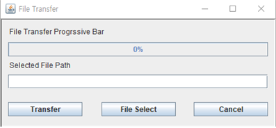

<h2>Outline</h2>

◈ Homework #5
To implement the Chatting and File transfer client

◈ Description
네트워크(API)를 통한 다른 시스템(machine)의 process간 통신
실제 Network (Ethernet Protocol) 을 이용해서,
Chatting과 File 전송을 동시에 할 수 있는 Application 구현


<h2>Development Environment</h2>

```
Java, jnetpcap, Swing 사용. 데이터 통신 과목 실습 과제. jnetpcap, winpcap을 설치해야 작동한다.
```
<h2>Screen shot</h2>

<p align="center">
   
</p>
<p align="center">
   
</p>
<p align="center">
   
</p>


<h2>Part of Report</h2>

byte들의 전송으로, 파일을 전송할 수 있는 프로토콜을 만든다. 파일 전송 프로토콜은 채팅 프레임 전송 프레임과 별도로,
동시에 전송될 수 있어야 한다.


#### 실습 시나리오 (채팅 전송 측)

```
1. 프로그램을 실습할 두 대의 컴퓨터를 준비하고 랜선으로 연결함. 이더넷 네트워크 이외의 네트워크들을 모두 꺼줌.
2. Wireshark로 이더넷 드라이버에서 송수신 되는 패킷을 확인해, 컴퓨터끼리 연결이 잘 되었는지를 확인함. 패킷을
   송신한 컴퓨터가 다시 상대 컴퓨터의 EthernetLayer에서 전송한 Ack 패킷을 받게 될 것임.
3. PC 1 에서 Menu > Mac Address Setting 버튼을 클릭해, 주소 설정 창에서 NIC_ComboBox를 알맞게 설정하고,
   Destination Mac Address엔 상대 컴퓨터의 Source Mac Address를 직접 입력함.
4. PC 2 에서도 똑같이 Mac Address를 설정한다. 서로 지정한 상대 컴퓨터의 Mac Address가 일치해야 한다.
5. 채팅을 전송할 프로세스에서 채팅창에 1456 바이트 이상의 길이의 String 데이터와 1456 바이트보다 작은 String
   데이터를 키보드로 입력하고, 각각 Send 버튼을 클릭함
6. StopAndWaitDlg (GUI Layer)에서 ChatApp 레이어의 Send를 호출하고 String 데이터를 byte[] 로 인코딩 해, 전
   송함. 아래 레이어는 그 아래 레이어로 데이터를 전송하는데 이 때 해당하는 레이어의 정보를 헤더로 만들어 붙임.
7. ChatAppLayer의 송신 쓰레드에서 1456 바이트보다 작은 데이터는 (메시지큐를 거쳐) 바로 전송하고, 1456 바이트
   보다 큰 데이터는 메시지큐에 넣어놓았다가, 1456 바이트 씩 잘라 전송하고, 상대 프로세스가 전송한 Ack 신호를 받
   을 때 마다 다음 프레임을 전송함.
8. NILayer에서 jnetPcap을 이용해 랜선으로 데이터를 전송함
9. 수신하는 쪽 프로세스의 NILayer에선 랜선으로 들어온 데이터는 모두 들어오며, 위 레이어의 Receive를 호출.
10. Ethernet Layer 쪽 Receive 함수에서, Ethernet Frame을 확인해 들어온 데이터의 Dst Address가 본인 프로세
    스가 갖고 있는 Source Address와 일치하는지, 또는 들어온 데이터가 브로드캐스팅인지 확인해, 일치하는 경우 필요
    없어진 Ethernet 헤더를 제거하고, 위 쪽 레이어로 남은 데이터를 올려 보냄. 데이터가 위 레이어로 성공적으로 올려
    보내지면, 데이터를 정상적으로 수신했다는 의미로 Ack 패킷을 만들어 보냄.
11. ChatAppLayer에서 단편화 되지 않은 패킷은 바로 위 레이어로 올려 보내고, 단편화 되어 있는 패킷은 버퍼에 저
    장해 놓았다가 마지막 패킷을 수신했을 때 위 레이어로 버퍼의 내용을 올려보내고, 버퍼를 비움.
12. 결과적으로 최상위 레이어 (GUI) 측에선, 메시지를 송신한 프로세스 측이 보낸 데이터를 그대로 전달받게 됨.
    byte[]을 다시 String으로 UTF-8 로 인코딩한 후, Chatting Area 쪽에 append 해 수신한 메시지를 표시함.
13. 채팅 쓰레드는 파일 전송 쓰레드 및 GUI 쓰레드 (메인 쓰레드) 와 별개로 동작한다. 따라서, 채팅 큐에 메시지가
    차 있어도 새 채팅 프레임을 만들 수 있으며, 파일 전송 중에도 채팅 프레임을 전송하는데 문제가 없다.
```


#### 실습 시나리오 (파일 전송 측)

```
1. 프로그램을 실습할 두 대의 컴퓨터를 준비하고 랜선으로 연결함. 이더넷 네트워크 이외의 네트워크들을 모두 꺼줌.
2. Wireshark로 이더넷 드라이버에서 송수신 되는 패킷을 확인해, 컴퓨터끼리 연결이 잘 되었는지를 확인함. 패킷을
   송신한 컴퓨터가 다시 상대 컴퓨터의 EthernetLayer에서 전송한 Ack 패킷을 받게 될 것임.
3. PC 1 에서 Menu > Mac Address Setting 버튼을 클릭해, 주소 설정 창에서 NIC_ComboBox를 알맞게 설정하고,
   Destination Mac Address엔 상대 컴퓨터의 Source Mac Address를 직접 입력함.
4. PC 2 에서도 똑같이 Mac Address를 설정한다. 서로 지정한 상대 컴퓨터의 Mac Address가 일치해야 한다.
5. PC 1 에서 Menu > File Transfer 버튼을 클릭해, 파일을 전송할 용도로 만든 창을 띄운다.
6. PC 1 의 File transfer 창의 File Select 버튼을 클릭해, 파일 선택 JFileChooser 객체를 만들어, 파일 선택 창을
   띄운다.
7. 파일 선택 창에서 전송할 파일을 선택하고 열기 버튼을 클릭한다.
8. File Transfer 창 내 Selected File Path에 선택한 파일의 경로가 제대로 들어가 있는지 확인하고, Transfer 버튼
   을 클릭한다.
9. 파일의 이름을 담은 첫 번째 프레임이 상대에게 전송된다. 상대 측 컴퓨터는 프레임을 받고 데이터를 String으로
   만들어 파일을 저장할 때 이 String 데이터를 파일의 이름으로 쓰게 된다.
10. FileInputStream 객체를 생성해 선택된 파일을 읽어와 byte[] 에 저장한다.
11. 파일 전송 큐에 읽어온 파일 byte[]을 add 하고, 전송 쓰레드에 send_lock 객체에 notify 해, 파일 전송 쓰레드를
    깨운다. (없으면 이 때 쓰레드 객체 생성)
12. 파일 전송 쓰레드는 1448 바이트보다 작은 데이터는 (파일 전송 큐를 거쳐) 바로 전송하고, 1448 바이트보다 큰
    데이터는 파일 전송 큐에 넣어놓았다가, 1448 바이트 씩 잘라 전송하고, Thread.Sleep 으로 일정 시간 기다렸다가,
    한 프레임 씩 상대 컴퓨터로 전송함. 아래 레이어는 그 아래 레이어로 데이터를 전송하는데 이 때 해당하는 레이어의
    정보를 헤더로 만들어 붙임.
13. NILayer에서 jnetPcap을 이용해 랜선으로 데이터를 전송함
14. 수신하는 쪽 프로세스의 NILayer에선 랜선으로 들어온 데이터는 모두 들어오며, 위 레이어의 Receive를 호출.
15. Ethernet Layer 쪽 Receive 함수에서, Ethernet Frame을 확인해 들어온 데이터의 Dst Address가 본인 프로세
    스가 갖고 있는 Source Address와 일치하는지, 또는 들어온 데이터가 브로드캐스팅인지 확인해, 일치하는 경우 필요
    없어진 Ethernet 헤더를 제거하고, 위 쪽 레이어로 남은 데이터를 올려 보냄.
16. 수신 컴퓨터 FileAppLayer에서 단편화 되지 않은 패킷은 바로 위 레이어로 올려 보내, 파일을 생성하고, 단편화
    되어 있는 패킷은 버퍼에 FileFrame이란 객체 (순서와 바이트 데이터를 지님) 의 형태로 저장해 놓았다가 마지막 패킷
    을 수신했을 때 FileFrame 내 index 값, 즉 fapp_seq_number로 Collections.sort()를 이용해 정렬해 원래 파일의
    데이터가 되게 한다. 그 후 FileFrame의 리스트를 배열 형태로 고치고, 위 레이어로 올려보낸다.
17. 결과적으로 최상위 레이어 (GUI) 측에선, 파일을 송신한 프로세스 측이 보낸 파일의 byte[]을 전달받게 됨.
    byte[]을 Files.write을 이용해 파일의 형태로 복원한다. 파일 종류나 확장자에 상관 없이 파일이 복원 (전송) 된다.
18. 파일 전송 쓰레드는 채팅 쓰레드 및 GUI 쓰레드 (메인 쓰레드) 와 별개로 동작한다. 따라서, File Transfer 중에도
    새 채팅 프레임을 만들 수 있으며, 채팅 프레임 전송 중에도 파일을 전송하는데 문제가 없다.
```

